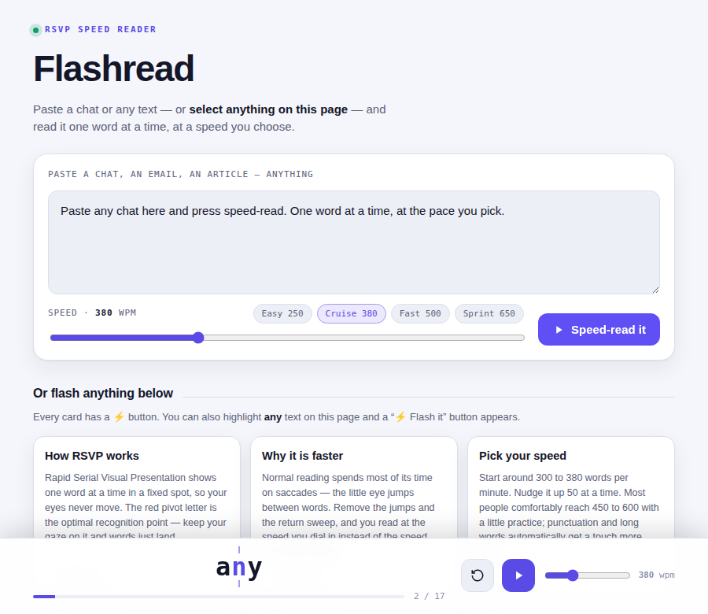

# Flashread ⚡

An RSVP (Rapid Serial Visual Presentation) speed reader. Paste any chat or text,
or **select anything on the page**, and read it one word at a time — at a speed you choose.



## Features

- **Flash any text** — paste a whole chat/email/article into the box and press *Speed-read it*.
- **Flash any selection** — highlight text anywhere on the page and a **⚡ Flash it** button
  appears at your cursor. Click it and that exact selection starts playing.
- **Flash any card** — every info card has its own ⚡ button.
- **Choose your speed** — slider (150–900 wpm) plus one-tap presets (Easy 250 / Cruise 380 /
  Fast 500 / Sprint 650). Two synced sliders let you change pace mid-read. Your speed is
  remembered across visits.
- **Smart pacing** — punctuation and long words automatically get a little more time.
- **Optimal Recognition Point** — the red pivot letter stays pinned to the center guide so your
  eyes never move.
- **Keyboard** — `Space` toggles play/pause.
- **Light & dark** — follows your system theme (and the viewer's toggle).

## Run it

No build step, no dependencies to run:

```bash
npm start        # or: node server.js   (PORT=8080 node server.js)
# open http://localhost:3000
```

Or just open `index.html` directly in a browser.

## Deploy

It's a static site — deploys to any static host as-is (Vercel/Netlify/Cloudflare Pages/GitHub
Pages). `vercel.json` is included for zero-config Vercel deploys.

## Test

A headless Chromium smoke test drives the real UI (word advance, pause, speed sync/persist,
card-flash, selection-flash, console-error check):

```bash
npm i -D playwright-core
PORT=4173 node server.js &
URL=http://localhost:4173/ node scripts/smoke.mjs
```

## Structure

```
index.html        markup
assets/app.css    theme tokens + layout (light/dark)
assets/app.js     RSVP engine, speed control, selection-to-flash
server.js         zero-dependency static file server
scripts/smoke.mjs headless UI smoke test
```
